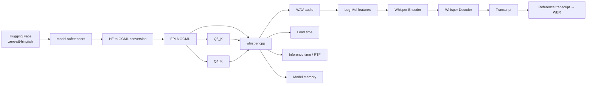

# Day 1 — Indian-Language ASR Benchmark

This project benchmarks open-source ASR models for Indian-language speech, with a focus on **Hindi, Hindi-English code-mixed speech, telephony audio, and long-form audio**.

The Day 1 work covers:

* Data source survey
* Open-source model survey and selection
* Evaluation dataset selection
* Long-audio inference investigation
* Benchmarking across clean, telephony, and code-mixed speech
* WER, CER, and RTF evaluation

---

# Part 1a — Data Sources

The following datasets were reviewed for Indian-language ASR training and evaluation.

| Dataset                                | Languages                     |               Approx. Hours | Speech Type                        | Code-Mixed                       | License / Access              | Purpose               |
| -------------------------------------- | ----------------------------- | --------------------------: | ---------------------------------- | -------------------------------- | ----------------------------- | --------------------- |
| **IndicVoices**                        | 22 Indian languages           |                     11,200+ | Diverse, prompted and natural      | No explicit code-switching       | CC BY 4.0 / gated             | Training              |
| **Kathbath**                           | 12 Indian languages           |                       1,684 | Crowdsourced read speech           | No explicit code-switching       | CC BY 4.0 / release dependent | Training / Evaluation |
| **Kathbath-Noisy / Hard**              | 12 Indian languages           |           Release dependent | Noisy read speech                  | No explicit code-switching       | Release dependent             | Evaluation            |
| **Shrutilipi**                         | 12 Indian languages           |                      6,400+ | Broadcast news                     | No                               | CC BY 4.0                     | Training              |
| **Lahaja**                             | Hindi                         |                        12.5 | Read + extempore                   | No explicit Hinglish split       | Dataset specific              | Evaluation            |
| **Svarah**                             | Indian-accented English       |                         9.6 | Indian-accented English            | No                               | CC BY 4.0                     | Evaluation            |
| **Vistaar**                            | 12 Indian languages           | 10,700+ training collection | Mixed domains, including telephony | Yes through constituent datasets | Dataset dependent             | Training / Evaluation |
| **Google FLEURS**                      | 102 languages                 |                ~12/language | Read speech                        | No                               | CC BY 4.0                     | Evaluation            |
| **Mozilla Common Voice**               | Multiple languages            |           Release dependent | Crowdsourced read speech           | Not specifically code-mixed      | CC0 current releases          | Training / Evaluation |
| **MUCS Hindi-English**                 | Hindi + English               |                       95.04 | Technical lectures                 | **Yes**                          | CC BY-SA 4.0                  | Training / Evaluation |
| **Gram Vaani**                         | Hindi                         |             ~1,100 released | Spontaneous telephone speech       | No explicit Hinglish split       | Academic-use access           | Evaluation            |
| **Navana Hindi / Indic ASR Benchmark** | Hindi + other Indic languages |      ~15.5 h Hindi held-out | Held-out evaluation                | No explicit code-mix split       | Dataset / repo dependent      | Evaluation            |

### Dataset observations

* Large datasets such as **IndicVoices, Kathbath, Shrutilipi, and Vistaar** are primarily useful for training and broad evaluation.
* **MUCS Hindi-English** provides an explicit Hindi-English code-switching condition.
* **Gram Vaani** provides natural, telephone-quality Hindi speech.
* **Lahaja** provides additional Hindi accent and regional variation.
* **Vistaar** combines multiple datasets and domains, making it useful for broader evaluation.

### Recommended evaluation sets

For evaluating Hindi ASR under realistic call-like and mixed-language conditions:

1. **MUCS Hindi-English** — explicit Hindi-English code-switching.
2. **Gram Vaani** — spontaneous telephone-quality Hindi with real-world acoustic variation.
3. **Lahaja** — Hindi accent and extempore speech diversity.

These datasets provide complementary evaluation conditions rather than representing one identical test set.

---

# Part 1b — Models

Five open-source ASR models were selected for the benchmark.

| Model                        | Architecture / Family   | Language Coverage              | Long-Audio Handling                |
| ---------------------------- | ----------------------- | ------------------------------ | ---------------------------------- |
| **Whisper large-v3-turbo**   | Whisper                 | Multilingual                   | 30-second chunks / stride          |
| **Fine-tuned Whisper Hindi** | Whisper fine-tuned      | Hindi                          | 30-second chunks                   |
| **IndicConformer 600M**      | Conformer / CTC         | 22 Indian languages            | 45-second chunks                   |
| **SraVaani 1.0**             | FastConformer / TDT-CTC | 65 Indian languages / dialects | 30-second chunks with overlap      |
| **NVIDIA Nemotron 3.5**      | FastConformer / RNNT    | Multilingual including Hindi   | Processor-defined streaming chunks |

Model cards were reviewed for:

* Languages used during training
* Tokenizer and output-script behavior
* Model architecture
* Supported input duration
* Long-audio/chunking behavior

All benchmark inference is performed locally. Customer audio should not be sent to external commercial APIs.

## Inference Problems and Solutions

### 1. Long-audio inference

Whisper and some Conformer-based models do not directly process arbitrarily long audio.

**Solution:** Audio is split into model-compatible chunks:

* Whisper: 30-second chunks with stride
* SraVaani: 30-second chunks with overlap
* IndicConformer: 45-second chunks
* Nemotron: processor-defined streaming chunks

### 2. ONNX long-sequence errors

Long Conformer audio caused attention / positional-encoding sequence-length mismatches.

**Solution:** Split long recordings into 45-second or smaller chunks while retaining the expected model input signature.

### 3. Incorrect model input

Passing additional `length` tensors to some model interfaces resulted in invalid or `None` inputs.

**Solution:** Use the model's expected call signature, for example:

```python
model(audio_tensor, language, "ctc")
```

### 4. Slow inference

Repeated model initialization significantly increased runtime.

**Solution:**

* Load each model once
* Reuse the model across evaluation slices
* Batch inference where supported
* Use optimized attention/runtime options where supported

---

# Part 1c — How to Evaluate

## Indian-Language ASR Benchmark

This project benchmarks five open-source ASR models on the audio in `data/`. It reports **word error rate (WER), character error rate (CER), and real-time factor (RTF)** for three slices:

* `clean`: original audio
* `telephony`: controlled telephone-bandwidth/noise simulation
* `code_mixed`: references containing both Devanagari and Latin-script words

The benchmark is intended for Hindi and Hindi-English speech, including long-form and telephony-style audio.

## Project layout

| Path                                     | Contents                                                                                                                           |
| ---------------------------------------- | ---------------------------------------------------------------------------------------------------------------------------------- |
| `data/`                                  | Evaluation audio and `gt.txt` ground-truth references.                                                                             |
| `modelcodesday1/evaluate_asr.py`         | Shared audio loading, resampling, normalization, WER/CER, telephony augmentation, code-mixed detection, and aggregation utilities. |
| `modelcodesday1/whisperltv3.py`          | `openai/whisper-large-v3-turbo` runner; uses 30-second chunks with a 5-second stride.                                              |
| `modelcodesday1/whisper_fintuned.py`     | Fine-tuned Hindi Whisper runner for `vasista22/whisper-hindi-medium`.                                                              |
| `modelcodesday1/indicconfor.py`          | `ai4bharat/indic-conformer-600m-multilingual` CTC runner; splits long audio into 45-second chunks.                                 |
| `modelcodesday1/sraavani.py`             | `ARTPARK-IISc/SraVaani-1.0` runner; uses 30-second chunks, 1-second overlap, and batching.                                         |
| `modelcodesday1/transcriber_nemotron.py` | NVIDIA Nemotron 3.5 streaming runner with processor-defined streaming chunks.                                                      |
| `modelcodesday1/numberRescoring.py`      | Standalone Hindi number normalization/inverse-normalization example using NeMo Text Processing.                                    |
| `modelcodesday1/Welcome_To_Colab.ipynb`  | Notebook used for interactive setup and experimentation.                                                                           |
| `modelbenchmark_day1/`                   | Saved JSON evaluation outputs and the benchmark results reported below.                                                            |

## Setup

From the repository root in PowerShell:

```powershell
python -m venv .venv

.\.venv\Scripts\Activate.ps1

pip install numpy soundfile psutil torch huggingface_hub nemo_text_processing

pip install --upgrade transformers
```

The scripts download models from Hugging Face on first use. Authenticate when a gated model requests access:

```powershell
.\.venv\Scripts\huggingface-cli.exe login
```

CUDA is used automatically when available; otherwise the scripts run on CPU.

The audio directory and ground truth default to:

```text
data/
data\gt.txt
```

The Nemotron runner uses `AutoModelForRNNT`; use an up-to-date Transformers release. If the import fails, rerun:

```powershell
pip install --upgrade transformers
```

before running the complete benchmark.

---

# Run the Complete Benchmark

The deliverable is one results table:

**model × slice → WER / CER / RTF**

All five evaluations can be reproduced with one command:

```powershell
powershell.exe -ExecutionPolicy Bypass -File .\run_benchmark.ps1
```

When PowerShell is already being used:

```powershell
.\run_benchmark.ps1
```

The wrapper runs every model with:

```text
--evaluate
--data-dir data
--ground-truth data\gt.txt
```

and writes fresh JSON files into:

```text
modelbenchmark_day1/
```

---

# Run Models Individually

Run these commands from the repository root:

```powershell
.\.venv\Scripts\python.exe modelcodesday1\whisperltv3.py --data-dir data --evaluate --ground-truth data\gt.txt --evaluation-output modelbenchmark_day1\whisperevaluation_results.json

.\.venv\Scripts\python.exe modelcodesday1\whisper_fintuned.py --data-dir data --evaluate --ground-truth data\gt.txt --evaluation-output modelbenchmark_day1\ftwhisper_evaluation.json

.\.venv\Scripts\python.exe modelcodesday1\indicconfor.py --data-dir data --evaluate --ground-truth data\gt.txt --batch-size 1 --evaluation-output modelbenchmark_day1\indicconfor_evaluation.json

.\.venv\Scripts\python.exe modelcodesday1\sraavani.py --data-dir data --evaluate --ground-truth data\gt.txt --batch-size 4 --chunk-seconds 30 --overlap-seconds 1 --evaluation-output modelbenchmark_day1\sravaani_evaluation.json

.\.venv\Scripts\python.exe modelcodesday1\transcriber_nemotron.py --data-dir data --evaluate --ground-truth data\gt.txt --lookahead-tokens 6 --evaluation-output modelbenchmark_day1\evaluation_results_nemotron.json
```

For transcription without scoring, omit `--evaluate` and provide:

```text
--output path.jsonl
```

Model-specific options can be viewed with:

```powershell
python modelcodesday1\<script>.py --help
```

---

# Evaluation Slices

### Clean

Original evaluation audio without additional transformations.

### Telephony

The same audio is transformed to simulate telephone conditions:

* Downsample to 8 kHz
* Apply narrowband / μ-law characteristics
* Add controlled noise
* Upsample back to the model's expected sampling rate

### Code-Mixed

Evaluation uses references containing both:

* **Devanagari-script words**
* **Latin-script English words**

This slice is intended to measure Hindi-English code-mixed recognition and script behavior.

---

# Metrics

The benchmark reports:

* **WER** — Word Error Rate
* **CER** — Character Error Rate
* **RTF** — Real-Time Factor
* **Peak CPU memory**

For code-mixed speech, additional analysis includes:

* Mixed error rate
* CER on Devanagari
* WER on Latin-script words
* English-word accuracy
* Wrong-script rate

Normalization is applied consistently before scoring. Indic vowel signs are preserved, while punctuation and number-formatting differences are handled according to the documented normalization policy.

---

# Results

Values below are aggregate metrics read from the JSON files in `modelbenchmark_day1/`.

WER and CER are error rates. RTF is mean inference time divided by audio duration. Lower values indicate lower error or lower inference time.

`n` is the number of evaluated recordings.

| Model                    | Slice      |  n |    WER |    CER |    RTF |
| ------------------------ | ---------- | -: | -----: | -----: | -----: |
| NVIDIA Nemotron 3.5      | clean      |  3 | 0.4156 | 0.4212 | 0.1605 |
| NVIDIA Nemotron 3.5      | telephony  |  3 | 0.4166 | 0.4194 | 0.1046 |
| NVIDIA Nemotron 3.5      | code-mixed |  1 | 0.4226 | 0.4366 | 0.1037 |
| Fine-tuned Whisper Hindi | clean      |  3 | 0.4851 | 0.5016 | 1.9540 |
| Fine-tuned Whisper Hindi | telephony  |  3 | 0.5477 | 0.5519 | 1.7156 |
| Fine-tuned Whisper Hindi | code-mixed |  1 | 0.5005 | 0.5234 | 3.2042 |
| IndicConformer 600M      | clean      |  3 | 0.4446 | 0.4490 | 0.2525 |
| IndicConformer 600M      | telephony  |  3 | 0.4397 | 0.4567 | 0.2231 |
| IndicConformer 600M      | code-mixed |  1 | 0.4580 | 0.4678 | 0.2565 |
| SraVaani 1.0             | clean      |  3 | 0.3616 | 0.3902 | 0.2287 |
| SraVaani 1.0             | telephony  |  3 | 0.3433 | 0.3858 | 0.1603 |
| SraVaani 1.0             | code-mixed |  1 | 0.3741 | 0.4086 | 0.0121 |
| Whisper large-v3-turbo   | clean      |  3 | 0.4301 | 0.3721 | 2.3070 |
| Whisper large-v3-turbo   | telephony  |  3 | 0.4388 | 0.3964 | 3.2807 |
| Whisper large-v3-turbo   | code-mixed |  1 | 0.4247 | 0.3767 | 2.0353 |

## Result Files

| Result File                        | Script                    |
| ---------------------------------- | ------------------------- |
| `evaluation_results_nemotron.json` | `transcriber_nemotron.py` |
| `ftwhisper_evaluation.json`        | `whisper_fintuned.py`     |
| `indicconfor_evaluation.json`      | `indicconfor.py`          |
| `sravaani_evaluation.json`         | `sraavani.py`             |
| `whisperevaluation_results.json`   | `whisperltv3.py`          |

Each JSON file contains:

* Model configuration
* Normalization policy
* Per-slice aggregates
* Per-record hypotheses
* Audio duration
* RTF
* Memory measurements

---

# Reproducibility

The benchmark is designed to be re-runnable using the same:

* Dataset and ground-truth references
* Audio preprocessing
* Normalization policy
* Model configuration
* Inference settings
* Evaluation scripts

The complete benchmark can be reproduced through:

```powershell
.\run_benchmark.ps1
```

Hardware, Python/PyTorch versions, model revisions, and runtime device can affect the reported results.

---

# Notes

* Model downloads can require substantial disk space and RAM/VRAM.
* Results depend on model revisions, hardware, PyTorch version, and runtime device.
* CUDA is used automatically when available.
* Inference is performed locally.
* Customer audio should not be sent to external commercial APIs.


# Day 2 (Error Analysis)


## Overall Comparison

| Model | Avg WER | Avg CER | Avg RTF | Key Observation |
|---|---:|---:|---:|---|
| **ARTPARK-IISc/SraVaani-1.0** | **35.25%** | 38.80% | 0.195 | Best overall Hindi WER |
| **NVIDIA Nemotron 3.5 ASR 0.6B** | 41.61% | 42.03% | **0.133** | Fastest model |
| **OpenAI Whisper large-v3-turbo** | 43.44% | **38.43%** | 2.794 | Best English/code-switch preservation |
| **AI4Bharat IndicConformer-600M** | 44.21% | 45.29% | 0.238 | Good short Hindi recognition |
| **vasista22/whisper-hindi-medium** | 51.64% | 52.68% | 1.835 | Highest overall error |

*Avg = mean of clean and telephony aggregate results over the 3 samples.*

## Main Error Buckets

| Bucket | Main Finding |
|---|---|
| **Code-switch / script** | Largest problem. English words are often converted to Devanagari or lost at language boundaries. |
| **Long-audio / segmentation** | Long 413s tutorial causes deletions, compression and tail truncation. |
| **Named entities** | Names and technical terms are sometimes phonetically confused. |
| **Numbers / dates** | Digit vs spoken-number mismatch, e.g. `उन्नीस सौ तिरानवे` → `1993`. |
| **Accent / dialect** | Mostly visible in the Lahaja sample. |
| **Noise / telephony** | Model-dependent; SraVaani and IndicConformer remain relatively stable, while Vasista degrades. |
| **Normalization artefacts** | Variants such as `फ़िल्म` / `फिल्म` / `फ़िल्म` can be counted as errors. |
| **Hallucination** | No confirmed hallucination from the supplied results. |
| **Short utterances** | Not sufficiently tested in the current benchmark. |

## Representative Errors

| Type | Reference | Hypothesis |
|---|---|---|
| Code-switch | `document` | `डॉक्यूमेंट` |
| Code-switch | `gnu/linux` | `जेएनयू लिनक्स` |
| Number | `उन्नीस सौ तिरानवे` | `1993` |
| Named entity | `किम` | `कीम` / `टीम` |
| Long audio | Full closing section | Tail content truncated |

## Model Summary

**SraVaani**
- Best overall WER.
- Strongest on short Hindi samples.
- Fast.
- Main weakness: poor English/code-switch preservation.

**Whisper large-v3-turbo**
- Best CER.
- Strongest English/code-mixed preservation.
- Much slower than the other models.
- Weaker on the Lahaja sample.

**Nemotron 3.5 ASR**
- Fastest.
- Good quality/latency trade-off.
- Code-switch accuracy and long-audio truncation are concerns.

**IndicConformer**
- Good short Hindi recognition.
- Fast.
- Long mixed-language speech remains difficult.

**Vasista Hindi Medium**
- Good first short sample.
- Highest overall WER/CER.
- Larger telephony degradation.


## Error Analysis & Failure Hypotheses

| Error Bucket | Likely Cause |
|---|---|
| **Code-switch / Script** | Mainly **training-data and decoding bias** toward Hindi script; English technical words are often transliterated into Devanagari. |
| **Numbers / Dates** | **Decoding + normalization** differences between spoken numbers and digits (`उन्नीस सौ तिरानवे` ↔ `1993`). |
| **Named Entities** | **Limited training coverage + acoustic ambiguity** for names, places, brands, and technical terms. |
| **Noise / Telephony** | **Audio front-end + training robustness**; 8 kHz/noisy speech can increase substitutions and deletions. |
| **Accent / Dialect** | **Training-data coverage** of regional pronunciation and dialect variation. |
| **Long Audio / Segmentation** | **Chunking, context limits, and decoding** can cause deletions or truncation in long recordings. |
| **Normalization Artefacts** | **Scoring/normalization issue**, especially for Hindi orthographic variants such as `फ़िल्म` / `फिल्म` / `फ़िल्म`. |
| **Hallucination / Short Utterances** | Not confirmed or sufficiently represented in this benchmark. |

### Model-specific observations

| Model | Main Observed Weakness |
|---|---|
| **SraVaani** | Strong Hindi accuracy, but weak **English/code-switch preservation**. |
| **Whisper large-v3-turbo** | Better **code-switch handling**, but slower and less consistent on some Hindi/accent samples. |
| **Nemotron 3.5 ASR** | Very fast, but **code-switch and long-audio handling** need attention. |
| **IndicConformer-600M** | Good short Hindi performance, but more **long-audio deletions**. |
| **Vasista Hindi Medium** | More **telephony degradation** and weaker long mixed-language performance. |

## Recommended 2-Model Shortlist

### 1. ARTPARK-IISc/SraVaani-1.0
Best choice for **overall Hindi ASR accuracy and speed** in this benchmark.

### 2. OpenAI Whisper large-v3-turbo
Useful as a **complementary model for Hindi-English code-switched speech**, especially where preserving English terminology matters.

### Why These Two?

SraVaani has the lowest overall WER, while Whisper preserves English/code-mixed terminology better. The two therefore cover the main strengths and weaknesses observed in the benchmark.

# Day 3 
  Part 3: Improvement plan :
   1.I have provided the wer reduction plan document here based on error analysis : Day3\Plan to Reduce WER.docx

   2. for the prototype , i have made whisper lora finetuning code to handle hinglish (code mix of hindi and english ) with approriate normalizer and preprocessing and dataset preparation . due to lack of gpu i haven't performed execution . 

   #part 4 

   # Modular Speaker Isolation + Whisper ASR

A modular audio front-end and ASR evaluation pipeline for conversational Indian-language speech using **`openai/whisper-large-v3-turbo`**.

The project evaluates the effect of:

- Stereo channel selection
- Silero VAD
- Pyannote speaker diarization
- Whisper ASR
- WER / CER
- RTF / latency

> **DeepFilterNet was initially explored but removed from the final pipeline because its `df` dependency was not reliably supported in the Colab environment. It is not part of the current implementation or results.**

---

## 1. Architecture

### Earlier architecture explored

```text
Input Audio
     |
     +--> Channel Selection
     +--> VAD
     +--> Diarization
     +--> DeepFilterNet
              |
              v
           Whisper
              |
          WER / CER / RTF
```

### Current architecture

```text
                         Input Audio
                              |
                       Load / 16 kHz
                              |
              +---------------+---------------+
              |               |               |
             RAW          Channel        Diarization
                          Selection            |
              |               |          Target Speaker
              +---------------+---------------+
                              |
                         Optional VAD
                              |
                              v
                  Whisper-large-v3-turbo
                              |
                         WER / CER / RTF
```

Whisper is kept fixed while the front-end stage changes, allowing preprocessing techniques to be compared consistently.

---

## 2. Project Structure

```text
speaker_whisper/
├── main.py
├── config.py
├── audio_utils.py
├── channel_separator.py
├── vad_processor.py
├── diarization_processor.py
├── whisper_asr.py
├── metrics.py
└── experiment_runner.py
```

| File | Purpose |
|---|---|
| `main.py` | Entry point and CLI |
| `audio_utils.py` | Load, resample, mono conversion, save |
| `channel_separator.py` | Left/right/average channel selection |
| `vad_processor.py` | Silero VAD |
| `diarization_processor.py` | Pyannote speaker isolation |
| `whisper_asr.py` | Whisper ASR |
| `metrics.py` | WER/CER |
| `experiment_runner.py` | Connect and evaluate stages |

---

## 3. Available Stages

| Stage | Workflow | Purpose |
|---|---|---|
| `raw` | Audio → Whisper | Baseline |
| `right_channel` | Right channel → Whisper | Known stereo customer channel |
| `vad` | Audio → VAD → Whisper | Remove non-speech |
| `right_channel_vad` | Right channel → VAD → Whisper | Channel isolation + VAD |
| `diarization` | Audio → Speaker isolation → Whisper | Mono multi-speaker audio |
| `diarization_vad` | Speaker isolation → VAD → Whisper | Speaker isolation + VAD |

`right_channel` stages require stereo audio. Channel position must be known from the recording setup; left/right alone does not identify the customer or agent.

---

## 4. Command-Line Flags

| Flag | Purpose |
|---|---|
| `--file` | Input audio |
| `--stage` | Stage to run or `all` |
| `--language` | Whisper language (`hi`, `te`, `en`, etc.); `auto` disables forced language |
| `--reference` | Reference text for WER/CER |
| `--vad-threshold` | VAD speech-confidence threshold |
| `--vad-min-speech-ms` | Minimum speech duration retained |
| `--vad-min-silence-ms` | Silence duration used for segmentation |
| `--vad-padding-ms` | Padding around detected speech |
| `--target-speaker` | Speaker selected after diarization |
| `--hf-token` | Hugging Face token for pyannote |
| `--save-audio` | Save processed audio sent to Whisper |
| `--output-dir` | Results directory |

For short responses such as **`हाँ`**, **`जी`**, and **`नहीं`**, `--vad-min-speech-ms` and `--vad-padding-ms` are especially important.

---

## 5. Example Commands

### Baseline

```bash
python main.py \
    --file call.wav \
    --language hi \
    --stage raw
```

### VAD

```bash
python main.py \
    --file call.wav \
    --language hi \
    --stage vad \
    --vad-threshold 0.40 \
    --vad-min-speech-ms 100 \
    --vad-min-silence-ms 200 \
    --vad-padding-ms 150
```

### Diarization + VAD

```bash
export HF_TOKEN="hf_..."

python main.py \
    --file call.wav \
    --language hi \
    --stage diarization_vad \
    --target-speaker SPEAKER_01 \
    --vad-threshold 0.40 \
    --vad-min-speech-ms 100 \
    --vad-min-silence-ms 200 \
    --vad-padding-ms 150
```

### Run all applicable stages

```bash
python main.py \
    --file call.wav \
    --language hi \
    --stage all \
    --save-audio
```

---

# 6. Evaluation Data

Experiments were performed using individual audios from:

- **MUCS**
- **Lahaja**
- **Gramvaani**

A separate overlap experiment used **three Hindi recordings from Kathbath**, which were combined into one mono recording.

The three Kathbath utterances were:

```text
उसको छोड़कर लोग इस प्रकार के मुद्दो पर चर्चा कर रहे है

उन्होंने कहा कि अतिथि अध्यापको को हटाना न्यायसंगत नहीं है

चीन में मोबाइल फोन की लत एक युवती को बड़ी मुश्किल में डाल गई
```

Combined reference:

```text
चीन में मोबाइल फोन की लत एक युवती को बड़ी मुश्किल में डाल गई उन्होंने कहा कि अतिथि अध्यापको को हटाना न्यायसंगत नहीं है उसको छोड़कर लोग इस प्रकार के मुद्दो पर चर्चा कर रहे है
```

---

# 7. Mono Audio Evaluation

## Mono Audio 1

```text
Duration: 9.51 s
Input: 8 kHz
Processed at: 16 kHz

VAD:
threshold = 0.40
minimum speech = 80 ms
minimum silence = 120 ms
padding = 100 ms
```

| Stage | WER | CER | RTF | Processed Duration |
|---|---:|---:|---:|---:|
| Raw | 0.3913 | 0.2281 | 0.1795 | 9.513 s |
| VAD | 0.3913 | 0.2544 | 0.1416 | 9.012 s |

VAD detected **5 speech segments**.

**Observation:** WER remained unchanged, CER increased, and RTF decreased.

---

## Mono Audio 2

```text
Duration: 11.64 s
Input: 16 kHz

VAD:
threshold = 0.40
minimum speech = 80 ms
minimum silence = 120 ms
padding = 100 ms
```

| Stage | WER | CER | RTF | Processed Duration |
|---|---:|---:|---:|---:|
| Raw | 0.7200 | 0.2569 | 0.1783 | 11.643 s |
| VAD | 0.7200 | 0.2569 | 0.1456 | 11.336 s |

VAD detected **1 speech segment**.

**Observation:** WER and CER remained unchanged, while RTF decreased.

### Mono Summary

| Metric | Observation |
|---|---|
| WER | Unchanged in both tests |
| CER | Unchanged in one test; increased in one |
| RTF | Lower with VAD in both tests |
| Overall | VAD reduced processing cost but did not consistently improve ASR accuracy |

---

# 8. Long-Form Audio Evaluation

A **413-second Hindi recording** was evaluated with multiple VAD settings.

### Run 1

```text
threshold = 0.40
minimum speech = 80 ms
minimum silence = 120 ms
padding = 100 ms
```

| Stage | WER | CER | RTF | Processed Duration |
|---|---:|---:|---:|---:|
| Raw | 0.4094 | 0.3147 | 0.1505 | 413.000 s |
| VAD | 0.4573 | 0.3490 | 0.1644 | 328.488 s |

VAD detected **169 speech segments**.

Change relative to raw:

```text
WER : +0.0479 absolute
CER : +0.0343 absolute
RTF : increased
```

---

### Run 2

```text
threshold = 0.30
minimum speech = 100 ms
minimum silence = 300 ms
padding = 200 ms
```

| Stage | WER | CER | RTF | Processed Duration |
|---|---:|---:|---:|---:|
| Raw | 0.4094 | 0.3147 | 0.1502 | 413.000 s |
| VAD | 0.4272 | 0.2992 | 0.1661 | 356.464 s |

VAD detected **116 speech segments**.

Change relative to raw:

```text
WER : +0.0178 absolute
CER : -0.0155 absolute
RTF : increased
```

---

### Run 3

```text
threshold = 0.25
minimum speech = 150 ms
minimum silence = 400 ms
padding = 250 ms
```

| Stage | WER | CER | RTF | Processed Duration |
|---|---:|---:|---:|---:|
| Raw | 0.4094 | 0.3147 | 0.1564 | 413.000 s |
| VAD | 0.4657 | 0.3419 | 0.1493 | 342.892 s |

VAD detected **146 speech segments**.

Change relative to raw:

```text
WER : +0.0563 absolute
CER : +0.0272 absolute
RTF : slightly decreased
```

### Long-Form Summary

| VAD Configuration | WER Effect | CER Effect | RTF Effect |
|---|---|---|---|
| `0.40 / 80 / 120 / 100` | Worse | Worse | Worse |
| `0.30 / 100 / 300 / 200` | Worse | Better | Worse |
| `0.25 / 150 / 400 / 250` | Worse | Worse | Better |

Format:

```text
threshold / min-speech / min-silence / padding
```

**Finding:** VAD is highly parameter-sensitive. No tested configuration improved WER, CER, and RTF simultaneously on this long-form recording.

---

# 9. Combined Kathbath Overlap Evaluation

Three Hindi Kathbath recordings were combined and overlapped.

```text
Duration: 9.60 s
Channels: 1
Language: Hindi

VAD:
threshold = 0.40
minimum speech = 100 ms
minimum silence = 200 ms
padding = 150 ms
```

| Stage | WER | CER | RTF | Processed Duration |
|---|---:|---:|---:|---:|
| Raw | 0.4444 | 0.3757 | 0.2064 | 9.600 s |
| VAD | 0.4444 | 0.3757 | 0.1968 | 8.780 s |
| Diarization | 0.4444 | 0.3757 | 0.2048 | 8.454 s |
| Diarization + VAD | 0.4444 | 0.3757 | 0.1672 | 8.454 s |

### Observation

For this overlap experiment:

- WER remained **0.4444** across all stages.
- CER remained **0.3757**.
- VAD reduced processed audio from **9.60 s to 8.78 s**.
- Diarization reduced processed audio to **8.454 s**.
- Diarization + VAD achieved the lowest RTF.

Thus, the front-end reduced processing cost but did not change recognition accuracy for this particular overlap example.

---

# 10. Overall Technique Comparison

| Technique | WER Effect | Latency / RTF | Production Role |
|---|---|---|---|
| Raw Whisper | Baseline | Baseline | Always useful as reference/fallback |
| Channel separation | Not measured on the supplied mono tests | Very low cost | Use when stereo channel mapping is known |
| Silero VAD | Mixed; unchanged on some tests, worse on long-form tests | Can reduce processed audio; effect depends on settings | Use only after tuning on representative calls |
| Diarization | No WER/CER change in combined test | Slight RTF improvement in combined test | Useful for genuine mono multi-speaker calls |
| Diarization + VAD | No WER/CER change in combined test | Lowest RTF in combined test | Good candidate for multi-speaker audio after validation |
| DeepFilterNet | Not evaluated in final pipeline | Not evaluated | Removed from current implementation |

---

# 11. Production Pipeline

### Fixed stereo channel mapping

```text
Stereo Audio
     ↓
Select customer channel
     ↓
Optional VAD
     ↓
Whisper
```

### Mono multi-speaker call

```text
Mono Audio
     ↓
Diarization
     ↓
Target Speaker
     ↓
Optional VAD
     ↓
Whisper
```

### Clean single-speaker audio

```text
Audio
  ↓
Whisper
```

The production pipeline should therefore enable preprocessing **based on the input type** rather than always running every stage.

---

# 12. Key Findings

1. **Channel separation** is computationally cheap and is useful when the telephony system provides a fixed customer/agent channel mapping.

2. **VAD reduces the amount of audio processed**, but the experiments show that this does not automatically reduce WER. VAD parameters need to be tuned on representative data.

3. **Short utterances require special attention.** Responses such as `हाँ`, `जी`, and `नहीं` should be included when selecting VAD parameters.

4. **Diarization is useful when speaker isolation is required**, particularly for mono recordings containing multiple speakers.

5. In the **combined Kathbath overlap experiment**, diarization + VAD achieved the lowest RTF while WER/CER remained unchanged.

---

# 13. Output

With `--save-audio`:

```text
speaker_whisper_results/
├── experiment_results.json
└── processed_audio/
    ├── call__raw.wav
    ├── call__vad.wav
    ├── call__diarization.wav
    └── call__diarization_vad.wav
```

The saved files allow direct inspection of the exact audio passed to Whisper for each stage.


# (DAY4) Part 5 — Low-Resource CPU ASR Benchmark

## Objective

Evaluate `shunyalabs/zero-stt-hinglish` against a low-resource CPU deployment target of **4 vCPU / 8–16 GB RAM, no GPU**, focusing on:

- Real-time factor (RTF), ideally **< 0.3**
- Inference latency
- Quantization impact on speed and memory
- WER impact of quantization
- Concurrent request capacity
- Reproducible evaluation

## Model and Runtime Used

**Model:** `shunyalabs/zero-stt-hinglish`  
**Base architecture:** OpenAI Whisper Medium  
**Runtime successfully tested:** `whisper.cpp`  
**Variants tested:** FP16, Q5_K, Q4_K  
**Execution:** Google Colab CPU path, 4 threads; `whisper.cpp` reported `no GPU found`

The checkpoint is loaded as Whisper **Medium**, with 24 encoder layers, 24 decoder layers, 1024-dimensional audio/text states, 16 attention heads, 80 mel bins and a 51,865-token vocabulary. The runtime reported a loaded model size of about **1533 MB for FP16**, **539 MB for Q5_K**, and **444 MB for Q4_K**.

> **Environment note:** measurements were obtained in Google Colab rather than on a dedicated 4-vCPU / 8–16 GB RAM VM. The benchmark logs show 4 threads and a CPU execution path with no GPU available, so the results are useful for comparison but should be treated as directional for production hardware.

## Architecture / Workflow



## Project Journey

1. Started with the Hugging Face `shunyalabs/zero-stt-hinglish` checkpoint.
2. Found that the initial `model.safetensors` was a Git-LFS pointer, so the actual weights were downloaded from Hugging Face Hub.
3. Converted the Hugging Face Whisper checkpoint to the GGML format used by `whisper.cpp`.
4. Ran the FP16 model with `whisper-cli`.
5. Quantized the F32 GGML source to **Q5_K** and **Q4_K**.
6. Ran the three short WAV files through FP16, Q5_K and Q4_K using 4 threads.
7. Captured model size, load time, inference time and RTF from the `whisper.cpp` logs.
8. Attempted a **413-second** long audio file; the FP16 run was interrupted after roughly **43 minutes**.
9. Attempted concurrency testing, but the Colab runtime/dependency setup did not produce a stable multi-request server benchmark.
10. Faster-Whisper, ONNX Runtime, sherpa-onnx and OpenVINO were not completed because the available compute/runtime environment did not allow a reliable apples-to-apples CPU comparison.

## Main Results

### Runtime × Quantization Summary

WER is calculated against the two supplied short-audio references: `01-00159-02.wav` and `audio.wav`. The third long-audio reference is discussed separately because the corresponding FP16 evaluation was interrupted and Q4_K/Q5_K full-long-audio results were not completed.

| Runtime | Quantization | WER | RTF on 3 short clips | Reported model memory | Latency per short clip | Concurrency |
|---|---|---:|---:|---:|---:|---|
| **whisper.cpp** | **FP16** | **39.13% pooled** | **15.05–19.23** | **1533.14 MB** | **174.58–206.49 s** | Not measured |
| **whisper.cpp** | **Q5_K** | **95.65% pooled** | **10.22–14.80** | **538.59 MB** | **118.60–180.50 s** | Not measured |
| **whisper.cpp** | **Q4_K** | **84.78% pooled** | **5.91–12.12** | **443.87 MB** | **68.56–147.85 s** | Not measured |
| faster-whisper | int8 | Not run | — | — | — | — |
| ONNX Runtime | int8 / dynamic | Not run | — | — | — | — |
| sherpa-onnx | int8 / supported model formats | Not run | — | — | — | — |
| OpenVINO | int8 | Not run | — | — | — | — |

> **WER interpretation:** this is a very small evaluation set (**2 reference clips / 46 reference words**). The WER values demonstrate the quantization-quality measurement workflow, but they are not a representative model-wide accuracy estimate.

### Per-Audio WER

WER was computed as word-level Levenshtein distance after Unicode normalization, lowercasing, punctuation removal and whitespace tokenization.

| Audio | Reference words | FP16 WER | Q5_K WER | Q4_K WER |
|---|---:|---:|---:|---:|
| `01-00159-02.wav` | 22 | **59.09%** | **77.27%** | **72.73%** |
| `audio.wav` | 24 | **20.83%** | **112.50%** | **95.83%** |
| **Pooled** | **46** | **39.13%** | **95.65%** | **84.78%** |

### Quantization WER Cost

Using pooled WER relative to FP16:

| Variant | Pooled WER | Change vs FP16 |
|---|---:|---:|
| FP16 | **39.13%** | baseline |
| Q5_K | **95.65%** | **+56.52 percentage points** |
| Q4_K | **84.78%** | **+45.65 percentage points** |

The largest degradation appeared on `audio.wav`: the Q5_K output switched to an English paraphrase rather than matching the Hindi reference, producing **112.50% WER**. This illustrates why quantization must be evaluated on both system metrics and recognition quality.

## Per-Audio Latency and RTF

`RTF = inference total time / audio duration`.

| Audio | Duration | FP16 latency / RTF | Q5_K latency / RTF | Q4_K latency / RTF |
|---|---:|---:|---:|---:|
| `Vaani_sample_02.wav` | 12.2 s | 206.49 s / **16.93** | 180.50 s / **14.80** | 147.85 s / **12.12** |
| `01-00159-02.wav` | 9.5 s | 182.67 s / **19.23** | 137.10 s / **14.43** | 90.65 s / **9.54** |
| `audio.wav` | 11.6 s | 174.58 s / **15.05** | 118.60 s / **10.22** | 68.56 s / **5.91** |
| **Mean** | — | **187.91 s / 17.07** | **145.40 s / 13.15** | **102.35 s / 9.19** |

The timing logs show the same trend across all three clips: Q4_K had the lowest measured latency/RTF, followed by Q5_K, then FP16.

## Quantization Results

The quantization step used an F32 GGML source of about **2913.89 MB** and produced:

| Variant | Quantized file size | Reduction vs F32 source |
|---|---:|---:|
| Q5_K | **513.64 MB** | **82.37%** |
| Q4_K | **423.31 MB** | **85.47%** |

At inference time, the loaded model sizes were approximately:

- **FP16:** 1533.14 MB
- **Q5_K:** 538.59 MB
- **Q4_K:** 443.87 MB

## Long-Audio Evaluation

A separate **413-second** audio file was tested with the FP16 model. The run produced transcription for the beginning of the recording but was manually interrupted after roughly **43 minutes**. The log contains output through approximately 2:24 of the audio before interruption.

Because that run is incomplete, a full-file WER would be misleading: the hypothesis does not cover the complete reference transcript. Q5_K and Q4_K were also not completed end-to-end on this long file.

**Long-audio WER: Not reported because the completed hypothesis did not cover the full reference.**

## Concurrency

Concurrency testing was attempted to determine how many simultaneous requests one machine could serve at acceptable latency. The Colab runtime/dependency setup prevented a stable multi-request server benchmark, so no defensible p95 latency/throughput curve was obtained.

Therefore:

**Concurrency: Not measured**

This is intentionally left blank rather than inferred from sequential `whisper-cli` execution. The proper follow-up is to run the persistent `whisper.cpp` server on the target **4-vCPU / 8–16 GB RAM** machine and measure concurrency using controlled concurrent requests.

## Runtime Coverage

| Runtime | Status | Result |
|---|---|---|
| `whisper.cpp` | **Completed** | HF conversion, FP16 inference, Q5_K/Q4_K quantization and CPU timing completed. |
| faster-whisper / CTranslate2 | Not benchmarked | Compute/time constraints prevented a reliable comparison. |
| ONNX Runtime | Not benchmarked | No reliable CPU benchmark completed. |
| sherpa-onnx | Not benchmarked | No completed supported model path for this checkpoint. |
| OpenVINO | Not benchmarked | No reliable CPU benchmark completed. |

## Reproducibility

The complete reproduction workflow, commands, model conversion steps, quantization commands, inference runs, reference transcripts and evaluation outputs are documented in the **Day 4 notebook attached in the Day 4 folder**.

This README intentionally summarizes the experiment rather than duplicating the notebook.

## Target vs Measured

| Metric | Target | Observed |
|---|---:|---:|
| CPU | 4 vCPU | Colab CPU path, 4 threads |
| RAM | 8–16 GB | Colab runtime |
| GPU | None | No GPU used by measured inference path |
| RTF | **< 0.3** | **5.91–19.23** on short clips |
| Quantization | int8 / low-bit | **Q5_K / Q4_K** |
| WER cost | Must be measured | Measured on 2 short reference clips |
| Concurrency | Must be measured | Not measured due to Colab server/runtime limitations |

## Practical Conclusion

The experiment established an end-to-end CPU optimization path for a Whisper Medium Hinglish checkpoint:

**Hugging Face → GGML → FP16 → Q5_K/Q4_K → CPU inference → WER + RTF + memory measurement**

Quantization substantially reduced the model footprint and improved inference speed, but the measured **RTF remained far above the <0.3 target**. The small reference set also shows a measurable accuracy cost: pooled WER increased from **39.13% (FP16)** to **95.65% (Q5_K)** and **84.78% (Q4_K)** in these two short clips.

The main engineering outcome is the measurement methodology: accuracy and systems metrics were evaluated together rather than assuming that lower-bit quantization is automatically free. The next validation step is to repeat the same benchmark on a dedicated 4-vCPU / 8–16 GB RAM machine and add a valid concurrency test.


